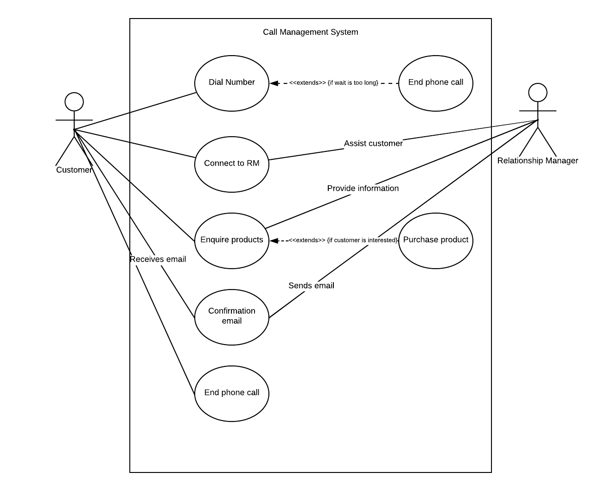
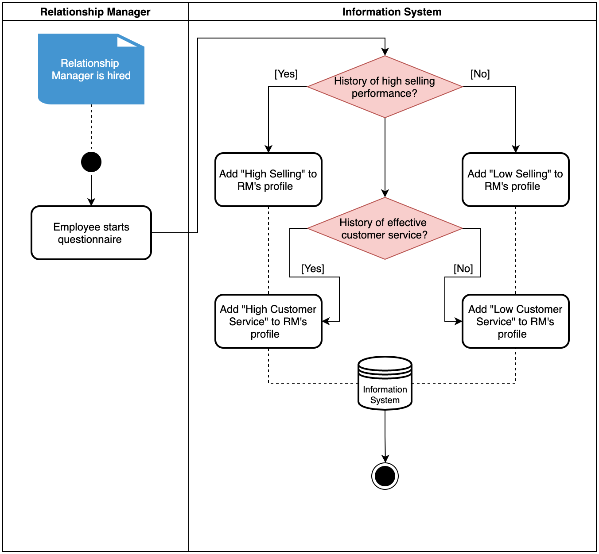
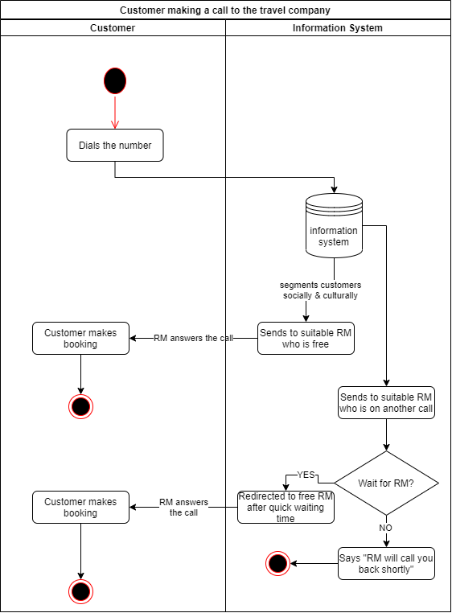
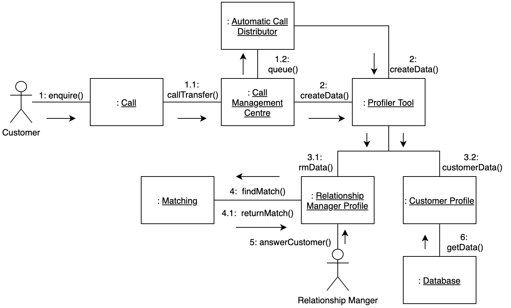

## ISDM – 31257 Autumn 2020 - Project Report (tute 2 - Abdul Babar)

### Table Of Contents
1. Project Objectives
2. Problem Definition
3. Stakeholders 
4. Product Backlog
5. Design Thinking 
6. Agile Methodology
7. Assumptions
8. Use Case Diagrams
9. Activity Diagrams
10. Class Diagram
10. Collaboration Diagram
12. Competitve Advantages
13. Presentation

### 1. **Project Objectives**
#### The primary objective is to develop a simplified information system that will improve the operation of the in-house call management system (CMC) of a major travel company. The following objectives will help accomplish this goal:  

* List the overall assumptions of the system.
* Define the problem from a design thinking perspective.
* Provide suggestions as to how the company can improve their operations.
* Document the proposed solutions including any Information System models and work products.
* Create diagrams that can be used to help explain, promote and visualise the new business system.
* Discuss advantages and disadvantages of improving the overall system as well as the failures that can be associated with this.

#### By achieving the above mentioned objectives and developing the information system, the travel company will be able to complete the following tasks more effectively:

* Sell holiday packages to potential customers efficiently.
* Minimize the inbound call costs by reducing per-call handling time.
* Improve call routing and dynamic call flow control for inbound and outbound calls.
* Improve accuracy when matching a customer to a Relationship Manager (RM) that suits the customer’s needs.
* Redirect the call of a customer to an Automatic Call Distributor which will route the call to the first available appropriate RM.

### 2. **Problem Definition**
The problem that this major travel company has is due to their Call Management Centre. Their CMC has a weak and cluttered call flow control which causes a clutter which causes customers to hang up due to the long wait time. The system operation is also complicated because of the varying number of Relationship Managers and nature of the holiday packages offered. These two main issues have led the comapany to request a new information system in order to improve both the CMC and the management of holiday packages and RMs.

The travel company requires a new information systems to meet the needs of the following stakeholders:
* Relationship Managers: Need a better calling system to effectively communicate with the customer, in order to sell the company’s products.
* Company: Needs an effective management system that enables them to work better internally. This would increase the overall organization of the business.   
* Company Owner: Needs an effective business tool that earns profit for the company as well as increasing overall company reputation.  
* Customers: Need to receive better customer service from the company. This can be fixed by being matched with the correct RM that is tailored to the customers profile and will be served by a qualified RM who is experienced in the customer’s needs. During busy times, they ccould be directed to an Interactive Voice Response so they do not suffer from a long wait time. 
* Travel companay: Need a good effective and convinient system that holiday package can be accessed easily RMs and exposed to customers. Thus, this will increase holiday package sales and gain more negotiation power to get a better value and high quality holiday packages. 

### 3. **Stakeholders (Empathy Maps)**

#####  1.  Investors

#####  2.  Relationship Manager (RM)

#####  3.  Company Owner

#####  4.  Customer

#####  5.  Travel Company

  

### 4. **Product Backlog (User Stories)**
#### Customers
* As a customer, I want the Relationship Manager to provide me with a personalised holiday package based on my needs so I can enjoy an authentic experience.
* As a customer, I want the Relationship manager to manage all my bookings because I will be paying for their services.
* As a customer, I want a notification when RM will call be back so that I do not have to wait on the phone for 30 minutes.
* As a customer, I want the Relationship Manager to send me a confirmation email with my booking details, so I can verify it.
* As a customer, I want the same Relationship Manager to serve me that served me earlier because they will be able to cater to my needs better and I trust them.
* As a customer, I want a confirmation email of RM's personal details so that I can contact the RM's directly if I have any questions in the future.
* As a customer, I want the Relationship Manager to provide me with travel advice, so I can make the right travel decisions.
* As a customer, I want to be connected to a suitable RM as soon as possible, so that I don't have to wait for a long time to be served.
* As a customer, I want the Relationship Manager to be knowledgeable in the travel areas I am interested in, so that I can get the best information possible.

#### Information System
* As an RM, I want the information system to automatically call customers on the target list so that I can do my job efficiently.
* As a RM, I want the information system to automatically connect me with customers that match my skill set, so that I can maximise sales.

#### Relationship Managers
* As a RM, I want an accurate matching system so that I can effectively assist customers with their needs and enquiries.
* As a RM, I want the system to provide guidelines and a script when calling customers, so that I can provide the best possible customer service.

#### Company Owner
* As a company owner, I want to improve the call flow rate so that my staff can serve customers effectively and efficiently. 
* As a company owner, I want to demonstrate the profiler tool so that I can convince the senior staff to accept the proposal.
* As a company owner, I want to have the profiler tool so that my staff can promote a service to a customer.
* As a company owner, I want to have the profiler tool so that my staff can achieve a sale.
* As a company owner, I want to have the RM feature implemented into my company so that the operation of our house call management centre will improve. 

#### Travel Company
* As a travel company. I want the system can allocate the RMs with specialised knowledge to customer so that my holiday package can be explained correctly.  
* As a travel company. I want system can send any related information that customer has enquired so that the appropriate holiday package can be sent to customer.
* As a travel company, I want RM to access to holiday package information so that I can sell the product.

### 5. **Approach from a Design Thinking Perspective**
Our approach to solve the problem that the travel company is experiencing will be shaped by the five stages of design thinking. Design Thinking can be broken up into five stages. Empathise, Define, Ideate, Prototype and Test.

Our first stage will consist of creating empathy maps in order to better understand the POV of our various stakeholders. These empathy maps will allow us to understand the problem as a whole as well as any concerns, questions and feelings our stakeholders have about this project. Using these empathy maps will enable us to create a problem statement which will summarise the problem that the company is experiencing. 

During the design phase, we aim to brainstorm a list of methods that will help solve the company problem through the Agile Scrum Methodology. We will then propose these methods to the travel company and ask for their opinion on our pproposed solutions. The Ideate and Prototype phase will consist of creating a variety of business diagrams such as the Collaboration, Sequence and Use Case Diagrams which will help us visualise to the stakeholder our interpretation of their requirements. This will also allow the stakeholder to give any feedback to us about their requirements. Finally, the test phase will consist of testing the product in order to ensure that it meets the stakeholder’s expectation and that it will be successful. 

### 6.  **Agile Methodology**
The Scrum framework we have used to carry out this procedure follows the values and principles of Agile methodology.  The Scrum team consists of three roles including a Product Owner, who is a single person allowing for faster decision making, Scrum Master, who is responsible for ensuring the Scrum framework and Agile methodology is enacted and a Development Team, who is responsible for building a potentially releasable product at the end of each Sprint.  

The Sprints are two weeks long allowing for faster feedback and more opportunities to improve on design, coding, testing, and documentation. Each Sprint starts with Sprint Planning to define a goal of the sprint and each Sprint ends with a Sprint Review and Sprint Retrospective, to examine what has been made, what worked well, what didn’t work well and ways to improve in the next increment. By the ended of each increment, a product has been designed, coded and tested. Through repetitive increments, the Development Team, Product Owner and Scrum Master can get feedback from the customer about the product development and any added requirements that the customer wants in their product.     

Scrum Artifacts used in this project include the Product Backlog, which consists of User Stories that outline the requirements for the system and product, Sprint Backlog which consists of a specific list of items taken from the product backlog to be completed in a sprint and the Sprint Burn-Down Chart which tracks the total amount of work remaining for the team to complete. The Burn-Down Chart is designed to predict when the work will be completed and is used to motivate the team throughout the sprint. 

### 7.  **Assumptions**

* The following project started from 1st January 2020. 
* The RM can be disconnected in a call at any time, either intentionally or unintentionally by the customer.        
* The customer will be calling the travel company for either: enquiries about existing products or interest in purchasing an existing product
* The customer cannot ask for a specific RM to serve them, as the customer will be directed to the first available RM that will meet their needs or enquiries.
* The customer has the option to purchase the product online or in-store, assuming that the travel company has a website and a physical store.
* There is an increase of customers during the holiday season, especially during school holidays.
* The current system can dial the same number automatically according to the target list generated.
* The phone call will not be recorded at any point in time due to privacy concerns.
* Assuming the call centre is still available during a pandemic, there will be an increase of enquiries rather than sales. However, there will be a decrease of RMs due to health and safety concerns.

### 8.  **Use Case Diagrams**

### 9.  **Activity Diagrams**

#####  i. Relationship Manager/Information System Diagram

  

#####  ii. Customer/Information System Diagram

  

### 10.  **Class  Diagram**

### 11. **Collaboration Diagram**

### 12. **Competitive Advantages**

This is some dot points
1.	Shorting Duration of Calls
-	RMs know exactly what customers’ need and want 
-	Appropriate information will be provided
-	Real-times updates – Customers can get the status of their holiday itinerary in real time 

2.	Improve Customer Service 
-	Contact beyond business operation hours – RMs can work from remote location and do not need to define to business operation hours = increase accessibility 
-	Reduce waiting time to get connection to a person 
-	Happier Customers 
3.	Reducing expenses  
-	Less advertisement expenses
-	No need office spaces and office equipment expenses
-	Right staffs are hired 
4.	Increase Profits
-	Manage more inbound calls
-	More sales will make 
-	Staffs will become efficient and productivity 
5.	Increase Business Values 
-	Increase business good will 
-	More investors 
-	Expand business without worrying extra cost 
-	Obtain accurate customer profile data which can be used for future services eg. Data mining
Negative: 
1.	Setting up Cost 
-	Implementation cost
-	Hiring cost 
-	Training and Educate Staffs 
2.	Network outage or natural disasters or phone congestion
-	Staffs availability to pick up the phone 
2.	Face to face relationships between customers and business 
-	Less accessing points to customers
-	No customers’ bonding 
3.	Miss communication
-	Not everything can be explained via phone 
4.	Security
-	Accessibility to customer data? What if system fails the retrieve accurate customers information?

### 13.  **Presentation**

##### (link)
