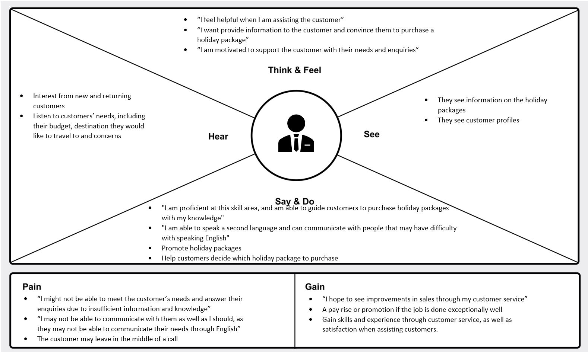
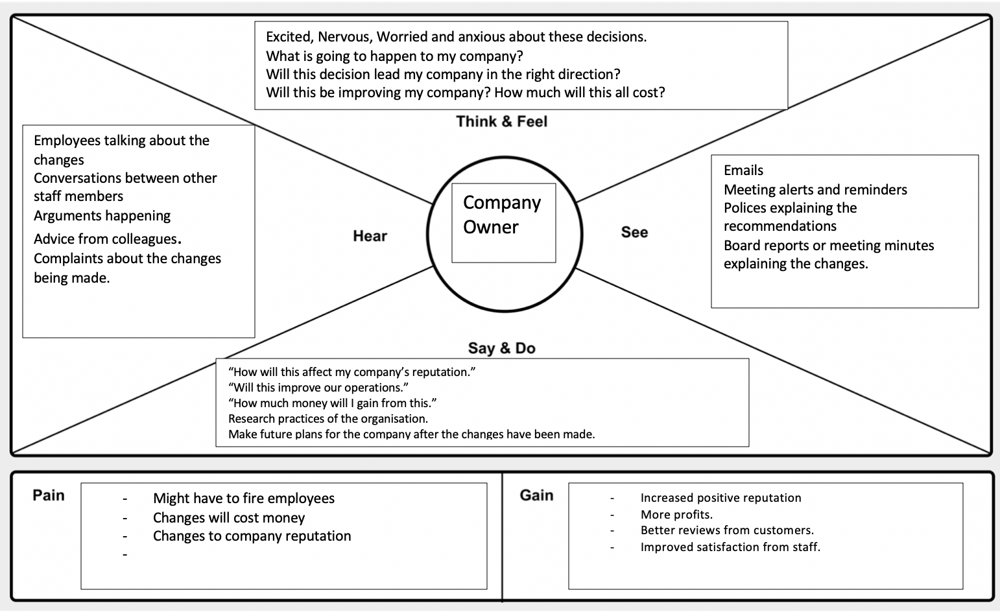
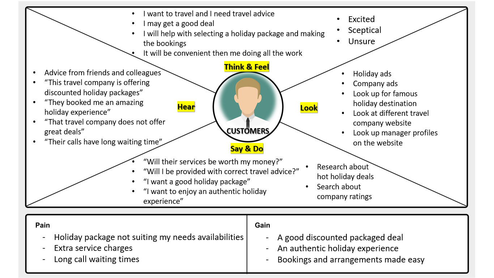
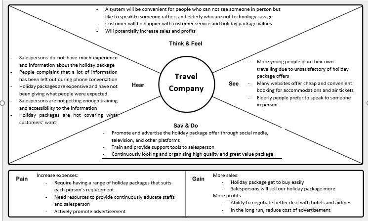

## ISDM – 31257 Autumn 2020 - Project Report (tute 2 - Abdul Babar)

### Table Of Contents
1. Project Objectives
2. Problem Defination
3. Stakeholders 
4. Design Thinking 
5. Agile Methodology
6. Assumptions
7. Use Case Diagrams
8. Activity Diagrams
9. Class Diagrams
10. Competitve Advantages

### 1. **Project Objectives**
#### The primary objective is to develop a simplified information system that will improve operation of the in-house call management system (CMC) of a major travel company. The following objectives can help accomplish this goal:  

* List the overall assumptions of the system.
* Define the problem from a design thinking perspective.
* Provide suggestions as to how the company can improve their operations.
* Document the proposed solutions including any Information System models and work products.
* Create diagrams that can be used to help explain, promote and visualise the new business system.
* Discuss advantages and disadvantages of improving the overall system as well as the failures that can be associated with this.

#### Achieving the above mentioned objectives and developing the information system will enable the travel company to: 

* Sell holiday packages to potential customers efficiently.
* Minimize the inbound call costs by reducing per-call handling time.
* Improve call routing and dynamic call flow control for inbound and outbound calls.
* Improve accuracy when matching a customer to a Relationship Manager (RM) that suits the customer’s needs.
* Redirect the call of a customer to an Automatic Call Distributor which will route the call to the first available appropriate RM.

### 2. **Problem Defination**
The problem that this major travel company faced that lead them to request a new information system was that thier present CMC has a weak call flow control which causes a clutter, making the customers hang up due to the long wait time. The system operation is also complicated because of the varying number of RMs and nature of the holiday packages offered.

The travel company requires a new information systems to meet the needs of the following stakeholders:
* Relationship Managers: Need a better calling system to effectively communicate with the customer, in order to sell the company’s products.
* Company: Needs an effective management system that enables them to work better internally. This would increase the overall organization of the business.   
* Company Owner: Needs an effective business tool that earns profit for the company as well as increasing overall company reputation.  
* Customers: Need to receive better customer service from the company. This can be fixed by being matched with the correct RM that is tailored to the customers profile and will be served by a qualified RM who is experienced in the customer’s needs. During busy times, they ccould be directed to an Interactive Voice Response so they do not suffer from a long wait time. 
* Travel companay: Need a good effective and convinient system that holiday package can be accessed easily RMs and exposed to customers. Thus, this will increase holiday package sales and gain more negotiation power to get a better value and high quality holiday packages. 

### 3. **Stakeholders**

#####  1.  Investors

#####  2.  Relationship Manager (RM)

#####  3.  Company Owner

#####  4.  Customer

#####  5.  Travel Company

### **Approach from a Design Thinking Perspective**
#####  Our approach to solve the problem that the travel company is experiencing will be shaped by the five stages of design thinking. Our first stage will consist of creating empathy maps in order to better understand the POV of our various stakeholders. These empathy maps will allow us to understand the problem as a whole as well as any concerns, questions and feelings our stakeholders have about this project. Using these empathy maps will enable us to create a problem statement which will summarise the problem that the company is experiencing. During the design phase, we aim to brainstorm a list of methods that will help solve the company problem through the Agile Scrum Methodology, the Ideate and Prototype phase will consist of creating a variety of business diagrams such as the Collaboration, Sequence and Use Case Diagrams which will help us visualise to the stakeholder our interpretation of their requirements. This will also allow the stakeholder to give any feedback to us about the requirement. Finally, the test phase will consist of testing the product in order to ensure that it meets the stakeholder’s expectation and that it will be successful. 

### **Agile Methodology**
##### The Scrum framework we have used to carry out this procedure follows the values and principles of Agile methodology.  The Scrum team consists of three roles including a Product Owner, who is a single person allowing for faster decision making, Scrum Master, who is responsible for ensuring the Scrum framework and Agile methodology is enacted and a Development Team, who is responsible for building a potentially releasable product at the end of each Sprint.  The Sprints are two weeks long allowing for faster feedback and more opportunities to improve on design, coding, testing, and documentation.  Each Sprint starts with Sprint Planning to define a goal of the sprint and each Sprint ends with a Sprint Review and Sprint Retrospective, to examine what has been made, what worked well, what didn’t work well and ways to improve in the next increment.   Scrum Artifacts used in this project include the product backlog, which consists of User Stories that outline the requirements for the system and product, and Sprint Backlog, which consists of a specific list of items taken from the product backlog to be completed in a sprint.

### **Assumptions**

* The following project started from 1st January 2020.
* For every RM, there is one customer served at a time. 
* For every RM. there is one RM profile created for them. 
* The RM can be disconnected in a call at any time, either intentionally or unintentionally by the customer.        
* The customer will be calling the travel company for either: enquiries about existing products or interest in purchasing an existing product
* The customer cannot ask for a specific RM to serve them, as the customer will be directed to the first available RM that will meet their needs or enquiries.
* The customer has the option to purchase the product online or in-store, assuming that the travel company has a website and a physical store.
* There is an increase of customers during the holiday season, especially during school holidays.
* The current system can dial the same number automatically according to the target list generated.

### **Use Case Diagrams**

### **Activity Diagrams**

### **Class  Diagrams**

### **Competitive Advantages**
