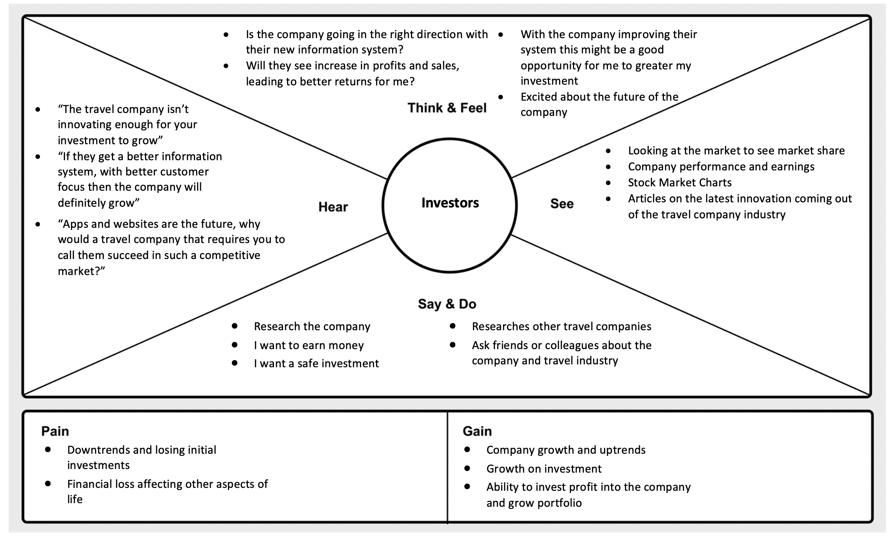

## ISDM – 31257 Autumn 2020 - project tut 2

### **Problem Objectives**
###### Our objective is to create an improved simplified system that improves the operation of their inhouse call management system. We aim to do complete this objective through the following:  
..* Provide suggestions as to how the company can improve their operations
..* Define the problem from a design thinking perspective
..* List the overall assumptions of the system 
..* Document our proposed solutions including any Information System models and work products
..* Create any needed diagrams that can be used to help explain, promote and visualise the new business system. 
..* 

### **Problem Statement**

### **Stakeholders**

#####  1.  Investors

#####  2.  Company Owner

